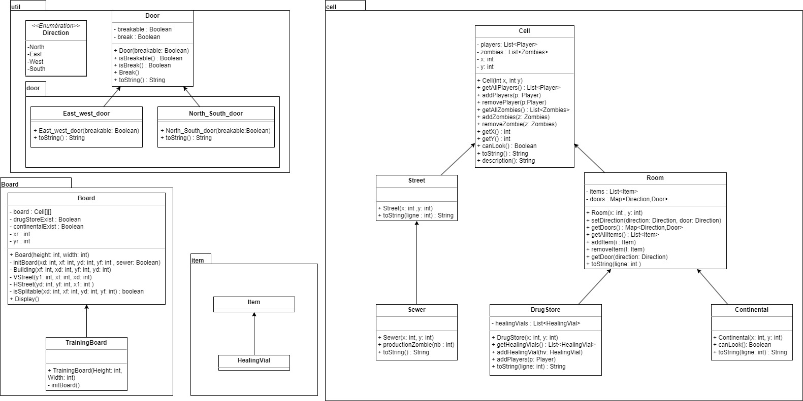

# l2s4-projet-2024

Vous devez *forker* ce projet dans votre espace de travail Gitlab (bouton `Fork`) et vidéo sur le [portail](https://www.fil.univ-lille.fr/portail/index.php?dipl=L&sem=S4&ue=Projet&label=Documents)
Un unique fork doit être réalisé par équipe.

Une fois cela réalisé, supprimer ces premières lignes et remplissez les noms des membres de votre équipe.
N'oubliez pas d'ajouter les autres membres de votre équipe aux membres du projet, ainsi que votre enseignant·e (statut Maintainer).

# Equipe

- Evan Joly
- Gabriel Kreutser
- Theo Nave
- Wissal-Asma Harrat

# Sujet

[Le sujet 2024](https://www.fil.univ-lille.fr/~varre/portail/l2s4-projet/sujet2024.pdf)

# Livrables

## Livrable 1

#### Description
Pour ce livrable 1, nous allons détailler nos choix de modélisation du plateau de jeu.  

Tout d'abord, le plateau est composé de 'Cell' qui permettent d'accueillir les différents éléments du jeu tels que les cases de la rue, les bâtiments, la pharmacie, etc...  
C'est pour cette raison que nous avons défini la classe Cell comme une classe abstraite.  
Une cellule est définie par ses coordonnées et peut accueillir une liste de joueurs et de zombies (ce qui n'est pas encore pris en compte et sera abordé dans le livrable 2). La classe Cell possède différentes méthodes, notamment les getters, mais également une méthode canLook() qui sera utile pour le Continental (où il est impossible de voir les joueurs à l'intérieur) et une méthode description() qui indique les coordonnées de la cellule, ainsi que son nombre de joueurs et de zombies.  

Passons maintenant aux classes qui héritent de Cell.  
ps : Tous les fils possèdent une méthode toString spécifique permettant de les représenter sous forme graphique dans la console.  

Nous avons la classe Street qui représente les cases 'rue' du plateau, qui n'ont rien de particulier excepté qu'elles ne possèdent pas de portes (nous verrons plus tard pourquoi). Il y a aussi la classe Sewer héritant de Street qui représente les bouches d'égout des cases rue, permettant la production de zombies à cet emplacement.  

Nous avons également la classe Room qui représente les pièces du plateau. Une Room a, en plus d'une Cell, une liste d'objets potentiels et des portes définies par une Map qui prend en paramètre une porte et une direction. La classe Direction est une classe d'énumération qui définit les 4 points cardinaux, et la classe Door permet de représenter une porte cassable ou non.  

Ensuite, nous avons la classe Continental qui hérite de Room. La spécificité de cette pièce est qu'il est impossible de voir les joueurs à l'intérieur, même avec une carte, et les acteurs ne peuvent pas s'attaquer à l'intérieur.  

Pour finir, il nous reste la classe DrugStore qui représente la pharmacie. Elle a la particularité de posséder une liste de potions qui augmente quand un joueur entre dans la pièce.  

Maintenant que nous avons les différents éléments constituant le plateau, intéressons-nous à l'algorithme de création du plateau.  

En effet, le plateau présente certaines particularités qui nécessitent une attention spéciale.  
Tout d'abord, le plateau est construit de manière aléatoire. Un immeuble est composé d'au moins 2 pièces en largeur et 2 en longueur. La pharmacie et le continental sont placés aléatoirement, et il y a 4 bouches d'égout aux extrémités de la rue principale.  

Pour modéliser tout cela, nous avons procédé de la manière suivante :  


**Gabriel**  
comment t'utilise ta recursivité  
comment les doors sont placé  

pas besoin de détailler le display je pense  


#### Etat de développement

Tout ce qui concerne le plateau est opérationnelle même s'il est possible qu'on y apporte certaines modifications suite à l'ajout des prochains éléments du jeu.  

La modélisation graphique du plateau peut nécessité des améliorations avec par exemple la présence des doubles portes (à l'heure actuelle, deux room collé entre elles génére deux portes)

Il est désormais nécessaire de s'interreser au différents acteurs, leurs spécificités mais égalements les items.  


### Génération de la documentation Java
Pour ce faire, on exécute la commande suivante :
```
javadoc -sourcepath src -subpackages zombicide.board zombicide.cell zombicide.exeption zombicide.util zombicide.util.door -d docs
```

### Compilation des classes
Pour compiler les classes, on exécute la/les commande(s) :
```
javac -sourcepath src src/*/*.java -d classes
```

### Compilation et lancement des tests
Pour compiler les tests, on exécute la/les commande(s) :
```
javac -classpath junit-console.jar:classes tests/zombicide/cell/*.java tests/zombicide/util/*.java 
```
Et maintenant pour les exécuter, on utilise :
```
java -jar junit-console.jar -classpath test:classes -scan-classpath
```

### Génération des fichiers .jar
Pour créer le/les fichiers .jar, on exécute la/les commande(s) :
```
jar cvfe livrable1.jar zombicide.Livrable1 -C classes .
```

### Lancement du programme
Ce projet permet l'utilisation d'arguments  

**Pour les fichiers .jar**  
On exécute la/les commande(s):
```
java -jar livrable1.jar
```
ou
```
java -jar livrable1.jar 10 10
```

**Sans .jar exécutable**  

On exécute la/les commande(s):
```
java -classpath classes zombicide.Livrable1 
```
### Image UML



## Livrable 2

### Atteinte des objectifs

### Difficultés restant à résoudre

## Livrable 3

### Atteinte des objectifs

### Difficultés restant à résoudre

## Livrable 4

### Atteinte des objectifs

### Difficultés restant à résoudre

# Journal de bord

## Semaine 1

Objectif de la semaine : Modéliser le plateau de jeu sous forme UML  

Remarque : Toutes les informations et caractéristiques de l'UML sont susceptibles de changer par la suite pour une meilleure implémentation du jeu    

Nous avons commencé par réfléchir avant toute chose aux éléments qui constituent le plateau de jeu (la ville).
Premièrement, le plateau est constitué de cases qui permettent d'accueillir les différents éléments du jeu. C'est pour cela qu'on a décidé d'établir la classe abstraite "Cell".  
Une case a pour propriétés :  

* Les joueurs, définis par une liste de joueurs
* Les zombies qui, comme pour les joueurs, sont définis par une liste de zombies
* La direction de la porte définie par une Map contenant une direction et une porte (on y reviendra plus tard)
* Sa position qu'on définit avec des coordonnées x, y
* Un type qui permettra d'identifier le rôle de la case

Pour les méthodes de la classe, on a pour l'instant créé ce qui nous semble le plus logique pour des cellules, comme addPlayer(), addZombie(), removePlayer(), removeZombie(), une méthode canLook() pour savoir s'il est possible de voir l'intérieur de la case et différents getters.  

Maintenant qu'on a l'élément principal, on peut s'intéresser aux éléments plus spécifiques.
Pour ce faire, on va utiliser l'héritage. Dans le jeu, nous avons deux éléments qui se distinguent pour le plateau : la rue et les salles. On crée donc deux classes qui héritent toutes les deux de Cell, la classe "Street" et la classe "Room".  

Pour la classe Room, un élément est différent des autres cellules, c'est la présence d'objets. Room aura donc pour propriété une liste d'objets (représentée par un objet Item) et aura des méthodes en lien avec cette propriété comme des add, remove, getter.   

La classe Street n'a rien de plus que Cell, excepté qu'elle héritera d'une classe "Sewer" qui permettra la production de zombies à chaque manche de jeu.  

Un élément important du jeu est l'existence de salles spéciales, le Continental et la pharmacie, qui ont des caractéristiques différentes des autres salles.  

Le Continental empêche l'attaque entre les acteurs et empêche les personnes de voir ce qu'il y a à l'intérieur. On crée donc une classe "Continental" qui hérite de Room.  

La pharmacie, quant à elle, permet aux joueurs de récupérer des fioles de guérison.
De plus, à chaque fois qu'un joueur entre dans cette pièce, une fiole est générée. On crée donc l'item "HealingVial" qu'on pourra utiliser pour la classe DrugStore qui hérite de Room. Elle a donc une liste de fioles en propriété avec les méthodes qui l'accompagnent : add, remove, getter.  

Revenons maintenant à la propriété direction de la classe Cell. Pour définir une porte à chaque direction, nous avons utilisé une Map qui regroupe les éléments d'une classe d'énumération "Direction" contenant les éléments : North, South, East, West, et une porte provenant d'une classe Door qui a des propriétés et des méthodes indiquant s'il est possible de "casser" la porte, c'est-à-dire si la porte est en bordure de plateau, on peut casser la porte menant vers le vide.  

Pour finir, nous avons commencé à réfléchir à la création de la classe "Board" possédant sa méthode initBoard() et de la classe "TestBoard".  

**Répartition du travail :**  
Evan Joly : Création et écriture de la classe astraite "Cell" + Exception  
Gabriel Kreutser : Création et écriture des classes Direction, Door, Board, TestBoard, Player, Zombie  
Théo Nave : Création diagramme UML, écriture des classes Street, Sewer et rédaction compte rendu Semaine 1  
Wissal-Asma Harrat : Création et écriture des classes Room, DrugStore, Continental, Item, HealingVial

Diagramme UML Semaine 1 : [https://nextcloud.univ-lille.fr/index.php/s/jBCi5HAjN92PnnY](https://nextcloud.univ-lille.fr/index.php/s/jBCi5HAjN92PnnY)

## Semaine 2
Objectif de la semaine : Concevoir l'algorithme de création du plateau  

Après avoir créé les différents éléments qui constituent le plateau de jeu, nous nous sommes penchés sur la manière de construire le plateau.  

Nous avons créé, dans la méthode initBoard() de la classe Board, un algorithme qui permet de créer un plateau d'une taille demandée. Cet algorithme place la rue principale de manière aléatoire sur le plateau et, si les conditions le permettent, utilise la récursivité pour créer plusieurs autres rues.  

À la création de chaque salle, les portes sont placées sur les 4 côtés de la salle, définis comme breakables, c'est-à-dire qu'il est possible de les ouvrir, sauf si elles se trouvent à l'extrémité du plateau, auquel cas elles sont définies comme unbreakables.  

De plus, les salles spéciales (drug store et continental) sont également placées de manière aléatoire sur le plateau.  

**Répartition du travail :**  
Evan Joly : Assistance à Gabriel + correction des bugs de l'algorithme du plateau  
Gabriel Kreutser : Création de l'algorithme du plateau (placement des salles et des rues)  
Théo Nave : Création des portes autour des salles à la création du plateau + rédaction du compte rendu Semaine 2  
Wissal-Asma Harrat : Création des méthodes addUniqueDrugStore et addUniqueContinental + implémentation de ces dernières dans l'algorithme  
## Semaine 3
Objectif de la semaine : Finaliser le plateau de jeu  

L'un des premiers enjeux de la semaine était la modélisation des portes. En effet, lors de l'affichage, l'idée principale était d'utiliser une structure de données map<Direction, String> dans la classe Door. Ainsi, en fonction d'un attribut passé en paramètre lors de l'appel de la méthode toString, la porte appropriée s'afficherait. Cependant, cette modélisation était peut-être trop complexe et pouvait être simplifiée.  

C'est pourquoi nous avons opté pour un héritage de la classe Door, devenue abstraite, en deux nouvelles sous-classes : NorthSouthDoor et EastWestDoor. Ces deux classes fusionnent les portes de cardinalités opposées, car elles affichent la même chose. Cette modélisation facilite l'appel des méthodes et la génération des chaînes de caractères pour les méthodes toString, rendant ainsi le code plus compréhensible.  

Un autre enjeu concernait la méthode display du board. En effet, l'idée principale d'afficher des chaînes de caractères représentant les portes de la manière suivante "|\n|" ne fonctionnait pas, créant ainsi une représentation d'affichage bancale en forme d'escalier.  

Pour remédier à cela, il a fallu afficher ligne par ligne en subdivisant l'affichage des cellules en quatre parties. Tout d'abord, les portes nord de la ligne de cellules, puis la première et deuxième partie du contenu des cellules avec l'initial des cellules et le nombre d'acteurs présents, ainsi que les portes Est et Ouest sur deux lignes. Enfin, la série de portes sud était affichée. Pour cela, il a été nécessaire de modifier toutes les méthodes toString des classes héritant de Cell, qui prennent maintenant en compte la ligne à afficher en tant que paramètre du toString. Cela permet, en fonction de la cellule, d'afficher une porte ou aucune, par exemple, si la cellule est une rue.  

Suite à ces modifications, il a été nécessaire de mettre à jour l'UML.   

**Répartition du travail :**  
Evan Joly : Modification des doors avec la nouvelle modélisation + correction de l'affichage du plateau + rédaction du Compte Rendu Semaine 3  
Gabriel Kreutser : Assistance à Evan sur l'affichage du plateau et la modélisation des doors.  
Théo Nave : Création des tests des classes présentes. + assistance rédaction compte Rendu  
Wissal-Asma Harrat : Correction du placement de DrugStore et Continental + mise à jour de l'UML  

Diagramme UML Semaine 3 : [https://nextcloud.univ-lille.fr/index.php/s/FiRLwak7YCSiqFc](https://nextcloud.univ-lille.fr/index.php/s/FiRLwak7YCSiqFc)
## Semaine 4

## Semaine 5

## Semaine 6

## Semaine 7

## Semaine 8

## Semaine 9

## Semaine 10

## Semaine 11

## Semaine 12
