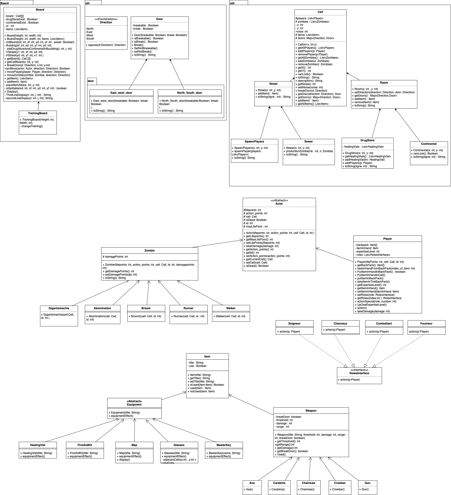

# l2s4-projet-2024

Vous devez *forker* ce projet dans votre espace de travail Gitlab (bouton `Fork`) et vidéo sur le [portail](https://www.fil.univ-lille.fr/portail/index.php?dipl=L&sem=S4&ue=Projet&label=Documents)
Un unique fork doit être réalisé par équipe.

Une fois cela réalisé, supprimer ces premières lignes et remplissez les noms des membres de votre équipe.
N'oubliez pas d'ajouter les autres membres de votre équipe aux membres du projet, ainsi que votre enseignant·e (statut Maintainer).

# Equipe

- Evan Joly
- Gabriel Kreutser
- Theo Nave
- Wissal-Asma Harrat

# Sujet

[Le sujet 2024](https://www.fil.univ-lille.fr/~varre/portail/l2s4-projet/sujet2024.pdf)

# Livrables

## Livrable 1

#### Description
Pour ce livrable 1, nous allons détailler nos choix de modélisation du plateau de jeu.  

Tout d'abord, le plateau est composé de 'Cell' qui permettent d'accueillir les différents éléments du jeu tels que les cases de la rue, les bâtiments, la pharmacie, etc...  
C'est pour cette raison que nous avons défini la classe Cell comme une classe abstraite.  
Une cellule est définie par ses coordonnées et peut accueillir une liste de joueurs et de zombies (ce qui n'est pas encore pris en compte et sera abordé dans le livrable 2). La classe Cell possède différentes méthodes, notamment les getters, mais également une méthode canLook() qui sera utile pour le Continental (où il est impossible de voir les joueurs à l'intérieur) et une méthode description() qui indique les coordonnées de la cellule, ainsi que son nombre de joueurs et de zombies.  

Passons maintenant aux classes qui héritent de Cell.  
ps : Tous les fils possèdent une méthode toString spécifique permettant de les représenter sous forme graphique dans la console.  

Nous avons la classe Street qui représente les cases 'rue' du plateau, qui n'ont rien de particulier excepté qu'elles ne possèdent pas de portes (nous verrons plus tard pourquoi). Il y a aussi la classe Sewer héritant de Street qui représente les bouches d'égout des cases rue, permettant la production de zombies à cet emplacement.  

Nous avons également la classe Room qui représente les pièces du plateau. Une Room a, en plus d'une Cell, une liste d'objets potentiels et des portes définies par une Map qui prend en paramètre une porte et une direction. La classe Direction est une classe d'énumération qui définit les 4 points cardinaux, et la classe Door permet de représenter une porte cassable ou non.  

Ensuite, nous avons la classe Continental qui hérite de Room. La spécificité de cette pièce est qu'il est impossible de voir les joueurs à l'intérieur, même avec une carte, et les acteurs ne peuvent pas s'attaquer à l'intérieur.  

Pour finir, il nous reste la classe DrugStore qui représente la pharmacie. Elle a la particularité de posséder une liste de potions qui augmente quand un joueur entre dans la pièce.  

Maintenant que nous avons les différents éléments constituant le plateau, intéressons-nous à l'algorithme de création du plateau.  

En effet, le plateau présente certaines particularités qui nécessitent une attention spéciale.  
Tout d'abord, le plateau est construit de manière aléatoire. Un immeuble est composé d'au moins 2 pièces en largeur et 2 en longueur. La pharmacie et le continental sont placés aléatoirement, et il y a 4 bouches d'égout aux extrémités des 2 rue principale (première créer).  

Pour modéliser tout cela, nous avons procédé de la manière suivante :  

Nous prenons une coordonnée aléatoire de la taille de la longueur et une autre de la largeur, tout en laissant de la place pour les immeubles, soit 2 par 2 minimum. 
Sur ces coordonnées, nous allons créer une route verticale, puis une horizontale.
Ensuite, nous rappelons récursivement 4 fois la fonction d'initialisation sur les 4 coins séparés par les 2 routes venant d'être créées.
S'il y a plus de 5 par 5 d'espace, alors nous refaisons une route et nous refaisons des appels récursifs. Sinon, nous construisons un immeuble.
Cet immeuble peut posséder un drugstore ou un Continental si la valeur du random tombe sur 0, sinon il ne place rien et diminue l'intervalle du random afin d'obliger le placement du Drugstore ou du Continental sur le plateau de jeu.


#### Etat de développement

Tout ce qui concerne le plateau est opérationnelle même s'il est possible qu'on y apporte certaines modifications suite à l'ajout des prochains éléments du jeu.  

La modélisation graphique du plateau peut nécessité des améliorations avec par exemple la présence des doubles portes (à l'heure actuelle, deux room collé entre elles génére deux portes)

Il est désormais nécessaire de s'interreser au différents acteurs, leurs spécificités mais égalements les items.  


### Génération de la documentation Java
Pour ce faire, on exécute la commande suivante :
```
javadoc -sourcepath src -subpackages zombicide.board zombicide.cell zombicide.exeption zombicide.util zombicide.util.door -d docs
```

### Compilation des classes
Pour compiler les classes, on exécute la/les commande(s) :
```
javac -sourcepath src src/*/*.java -d classes
```

### Compilation et lancement des tests
Pour compiler les tests, on exécute la/les commande(s) :
```
javac -classpath junit-console.jar:classes test/zombicide/cell/*.java test/zombicide/util/*.java 
```
Et maintenant pour les exécuter, on utilise :
```
java -jar junit-console.jar -classpath test:classes -scan-classpath
```

### Génération des fichiers .jar
Pour créer le/les fichiers .jar, on exécute la/les commande(s) :
```
jar cvfe livrable1.jar zombicide.Livrable1 -C classes .
```

### Lancement du programme
Ce projet permet l'utilisation d'arguments  

**Pour les fichiers .jar**  
On exécute la/les commande(s):
```
java -jar livrable1.jar
```
ou
```
java -jar livrable1.jar 10 10
```

**Sans .jar exécutable**  

On exécute la/les commande(s):
```
java -classpath classes zombicide.Livrable1 
```
### Image UML


## Livrable 2
Pour ce livrable 2, on va détailler la contribution de chaque membre du groupe dans la modélisation des acteurs, armes et equipements .

Evan: Pour ce livrable, j'ai concentré mes efforts sur la modélisation générale du joueur, en particulier sur la gestion de ses rôles multiples et sur le comportement de son sac à dos lors des différentes actions. J'ai également apporté un soutien à mes collègues en effectuant des relectures de code et en fournissant des feedbacks constructifs.

Notre première étape a été de définir comment attribuer des rôles à un joueur. Nous avons opté pour une approche utilisant une interface, RolesInterface, implémentant une méthode action. Chaque rôle implémente cette interface, ce qui permet de définir son comportement lorsqu'il est associé à un joueur. Étant donné qu'un joueur peut avoir plusieurs rôles, l'héritage des rôles ne convenait pas à cette situation. Nous avons donc utilisé une liste dans notre joueur pour contenir ses différents rôles, accompagnée d'une méthode actionSpécial pour appliquer les capacités des rôles aux joueurs lors des actions.

Notre deuxième défi a été la gestion du sac à dos et de la main du joueur. Nous avons initialement utilisé une hashmap pour modéliser le sac à dos, mais cela posait des problèmes de conception car le sac doit avoir un nombre limité d'emplacements. Nous avons donc opté pour un tableau d'objets, plus adapté. Ensuite, nous avons mis en place des méthodes pour ajouter des objets dans le sac, vérifier s'il était plein, échanger des objets entre le sac et la main, etc. Nous avons également ajouté la possibilité, non prévue initialement, de jeter un objet de la main sur la cellule où se trouve le joueur.

Nous avons également pris en compte la gestion de la mort du joueur. Lorsqu'il meurt, tous les objets de son sac et celui tenu en main sont placés au sol de sa cellule actuelle, ainsi que son niveau d'expertise, qui influe sur ses points d'action.

Gabriel: Pour ma part, j'ai été impliqué sur plusieurs aspects du projet. J'ai commencé par créer les squelettes des différentes classes nécessaires à notre application. Ensuite, j'ai travaillé en profondeur sur les classes Actor et Zombie, en rédigeant également les tests associés pour garantir leur bon fonctionnement. J'ai également adapté le plateau de jeu pour répondre aux nouvelles exigences, en incluant les tests nécessaires pour vérifier son bon fonctionnement. Parallèlement, j'ai pris en charge la documentation et la préparation du livrable 2. Bien que la majeure partie de mon temps ait été consacrée à ces tâches, j'ai également contribué de manière mineure au développement des objets.

Théo: Pour ce livrable, ma contribution a été plutôt passive. J'ai ajouté le concept de 'bruit' dans le jeu, élément que nous avions oublié dans le livrable précédent. De plus, j'ai développé les méthodes permettant aux acteurs (joueurs comme zombies) de se déplacer sur le plateau. J'ai également effectué divers tests pour les objets. J'ai également revu notre implémentation des armes pour utiliser l'héritage classique. Néanmoins, cela ne m'a pas empêché d'apporter quelques modifications mineures à certaines parties du code. Enfin, j'ai été responsable de la rédaction de la plupart des comptes rendus.

Wissal: Pour ma part, j'ai pris en charge la modélisation initiale de la partie des acteurs et des objets en créant un diagramme UML. J'ai principalement travaillé sur la modélisation des équipements et des armes. J'ai commencé à définir les effets des équipements en utilisant des inputs, notamment pour les kits de premiers secours, où j'ai ajouté l'attribut "id" à la classe Actor pour faciliter l'affichage des joueurs dans le plateau de jeu. J'ai également utilisé les classes listChooser et InteractivelistChooser fournies pour implémenter les méthodes equipmenteffect de FirstAidKit et masterKey. J'ai rencontré des difficultés pour modéliser l'effet de la MapCard, car je voulais utiliser des instanceof pour ne pas afficher le contenu de la cellule continentale, mais pour respecter les contraintes et les consignes du projet, j'ai modifié l'implémentation. J'ai exploré plusieurs approches pour modéliser les armes, avant d'opter pour un modèle plus simple utilisant l'héritage. C'est ce que m'a conseillé de faire les membres du groupe.
 J'ai également attribué un pistolet à chaque nouveau joueur dans la classe spawnPlayers. Enfin, j'ai mis à jour le diagramme UML et je suis en charge de la rédaction du livrable 2. je tiens à préciser que Chaque membre de l'équipe a rédigé sa propre partie pour fournir le maximum de détails sur sa contribution, j'ai juste fais des petites modifications.

### Etat de développement:
Maintenant qu'on a modélisé les players et les zombies, les armes et les equipements, on peut gérer ce qu'un joueur a dans son sac a dos, qu'il puisse ajouter ou enlever un item, qu'un acteur puisse se déplacer.
Par la suite, on va pouvoir attaquer la partie des actions et se focaliser encore plus sur les roles des joueurs et les actions que permettent les utilisations des différents items, et meme l'effet du bruit sur certains aspects.


### Génération de la documentation Java
Pour ce faire, on exécute la commande suivante :
```
javadoc -sourcepath src -subpackages zombicide.board zombicide.cell zombicide.exeption zombicide.util zombicide.util.door  zombicide.item.weapons  zombicide.item.equipment zombicide.item zombicide.actor.player.roles zombicide.actor.player zombicide.actor.zombie zombicide.actor -d docs
```

### Compilation des classes
Pour compiler les classes, on exécute la/les commande(s) :
```
javac -sourcepath src src/*/*.java -d classes
```

### Compilation et lancement des tests>
Pour compiler les tests, on exécute la/les commande(s) :
```
javac -classpath junit-console.jar:classes test/zombicide/cell/*.java test/zombicide/util/*.java test/zombicide/item/*.java test/zombicide/actor/player/*.java test/zombicide/actor/zombie/*.java test/zombicide/board/*.java test/zombicide/item/equipment/*.java
```
 pour les exécuter, on utilise :
```
java -jar junit-console.jar -classpath test:classes -scan-classpath
```

### Génération des fichiers .jar
Pour créer le/les fichiers .jar, on exécute la/les commande(s) :
```
jar cvfe livrable2.jar zombicide.Livrable2 -C classes .
```

### Lancement du programme
Ce projet permet l'utilisation d'arguments  

**Pour les fichiers .jar**  
On exécute la/les commande(s):
```
java -jar livrable2.jar
```

**Sans .jar exécutable**  

On exécute la/les commande(s):
```
java -classpath classes zombicide.Livrable2
```
### Image UML


## Livrable 3

Dans ce troisièmes livrable , c'est enfin l'heure de mettre en relation toutes les classe nous avons écrite précédemment , que ça soit les Item ou encore les différents acteur. Les actions vont nous permettre de déplacer un survivant, de le faire attaquer un zombie avec une arme etc... Tout que peut faire un joueur et un zombie!

En effet les actions faite pas le survivant et le zombie sont distincte donc deux implémentation différente mais qui suive un même schémas.

Pour le survivant nous avons utilisé une interface pour chacune de nos action, cette interface contient deux méthodes qui prenne en paramètre un survivant, une qui permet d'exécuter une action : `action(Player p)` et l'autre qui permet de vérifier qu'une action est jouable ce qui est utile lors de la création de la liste d'action du joueur pour vérifié quelle action il pourra faire `isActionPlayable(Player p)`. Cette interface est donc implémenté par chacune de nos action qui définisse un comportement qui leur est propre pour chacune des méthode.  
Pour le zombie l'interface et de la même forme sauf que les deux méthodes prenne maintenant un zombie en paramètre.

Pourquoi avoir choisis deux implémentation distincte ? Simplement car les actions réaliser par le survivant son différente de celle du zombie, elle n'ont de commun que le nom, ce n'est pas leur classe mère `Actor` qui en paramètre des actions mais bien le `Player` ou le `Zombie` car c'est deux classe on beau avoir des comportement commun traduit par la présence d'`Actor` , le survivant se démarque plus avec la présence du sac a doc ou encore de la main pour tenir des objets ou les levels. On ne peut donc pas utiliser une implémentation avec la classe `Actor` a cause de la perte d'information que l'on va avoir . Le fait que les deux soit distinct nous facilite grandement la tache dans l'implémentation des actions .

Il faut maintenant revenir sur une implémentation réaliser lors du livrable précédent celle des rôles. En effet nous avions crée une interface `roles`qui implémente une méthode `action` afin de réaliser une action lié à ce rôle or lors de la création des actions on à remarquer une grosse similarité d'implémentation entre les actions et les rôles. Nous avons donc conclu qu'il fallait les fusionner. Ainsi on a supprimé les méthodes `action` et `actionsSpéciale` du `Player`  car inutile.

Lors de ce livrable il nous a fallu aussi complété les effets des équipements avec notamment l'utilisation des `ListChooser<>` afin que l'action qui permet d'utiliser un équipement soit pleinement opérationnel car utilisant la méthode `ItemEffect()`

D'ailleurs cette méthode `ItemEffect()` de la classe `Item`  nous a fait poser la question lorsqu'elle est utiliser dans les `Weapons` de qui fait les dégât lors de l'attaque. En effet l'idée de bas était que la gestion de dégât qu'infligé un survivant avec son arme à un Zombie était dans la classe `Weapon` et dans la méthode `ItemEffect()` or cela donné des contraintes sur ce qu'on devais donné comme attributs des objets `Weapon` et complexifier vachement la chose. C'est pour cela qu'on a changer cela pour maintenant s'en occuper directement dans l'action attaquer ce qui vachement plus logique c'est bien le joueur qui, avec l'arme fait des dégât est non l'arme qui trouve qui attaquer et fait les dégâts elle même.

Ce livrable nous a permis aussi d'améliorer un partie de notre code qu'on avait délaisser. En effet nôtre coverage des différente ligne de code testé n'était pas vraiment au rendez vous. Nous avons donc lancé une grande opération de création de test unitaire dans le seul objectif d'atteindre les 100% de coverage et non pas d'avoir un jeu qui fonctionne. Ce qui nous a n'empêche permis de résoudre des bugs vieux comme le monde (janvier 2024), mais aussi globalement d'avoir une meilleur compréhension du code de chacun et d'analyse qui nous on permis résoudre d'autres soucis d'implémentation. Ainsi cette phase nous a aussi permis de faire du nettoyage de code afin d'avoir un code plus clean.

Voila globalement tout les points majoritaire  de la construction de ce 3e livrable , il n'y a pas tant a dire sur l'implémentation étant donné quelle est assez courte , mais ce sont les points central de raisonnement sur lesquels nous nous sommes pencher

### Etat du développement

Maintenant que toute les fonctionnalité du jeu sont en place action, item , acteur. Il faut s'occuper des  boucle de jeu , tour des survivant  , celui des  zombies et enfin la dernière qui s'occupera de mettre a jour la carte pour la préparation du prochain tour , tout ça dans une boucle principal. Bien sur ce n'est pas tout entre des changement de modélisation a prévoir pour le placement des piéce spécial (pharmacie ,drugStore) ou encore un ajout optimal des actions pour la list d'action de chaque joueur et l'amélioration de l'affichage. Il reste énormément de travail !!

### Commande de Génération et de compilation

>Génération de la doc :
```bash
javadoc -sourcepath src -subpackages zombicide -d docs
```

>Compilation des classes
```bash
javac -sourcepath src src/zombicide/board/*.java src/zombicide/cell/*.java src/zombicide/actor/*.java src/zombicide/exeption/*.java src/zombicide/item/*.java src/zombicide/util/*.java src/zombicide/*.java src/zombicide/actor/actionPlayer/*.java src/zombicide/actor/actionZombie/*.java src/zombicide/actor/player/*.java src/zombicide/actor/zombie/*.java src/zombicide/item/equipment/*.java src/zombicide/item/weapons/*.java src/zombicide/util/door/*.java src/zombicide/util/listchooser/*.java src/zombicide/util/listchooser/util/*.java -d classes
```

>Compilation des tests
``` bash
javac -classpath junit-console.jar:classes test/zombicide/board/*.java test/zombicide/cell/*.java test/zombicide/item/*.java test/zombicide/util/*.java test/zombicide/actor/actionPlayer/*.java test/zombicide/actor/actionZombie/*.java test/zombicide/actor/player/*.java test/zombicide/actor/zombie/*.java test/zombicide/item/equipment/*.java test/zombicide/item/weapons/*.java test/zombicide/actor/actionPlayer/roles/*.java test/zombicide/util/listchooser/util/*.java
```

>Exécution des tests
```bash
java -jar junit-console.jar -classpath test:classes -scan-classpath  
```

> Génération du jar
```bash
jar cvfe livrable3.jar zombicide.Livrable3 -C classes .  
```

>Lancement du programme avec le jar
``` bash
java -jar livrable3.jar  
```

>Lancement du programme sans le jar
``` bash
java -classpath classes zombicide.Livrable3
```

### Diagramme UML


## Livrable 4

Dans ce quatrième livrable , c'est enfin l'heure de mettre en relation tout les classe précedement créer afin de enfin jouer à notre jeu .

En effet , dans se quatrième livrable nous avons le plus claire de notre temps à rassembler toutes nos ancienne classe afin de faire de construire notre jeu .

Dans un premier temps , Nous avons fais la boucle principale du jeu avec la méthode `Play` qui appartient à la classe `Game`.
Dans cette méthode  nous appellons 3 autres méthodes `RoundPlayer` , suivie de `RoundZombie` et enfin `RoundUpdateBoard`.

Par conséquent dans le deuxième temps , nous avons créer c'est trois méthode . 
- `RoundPlayer` qui permet aux players d'executer des actions . De plus cette méthode nous a demander de créer une méthode `getBasicActionPoints` dans player afin de pouvoir rénissialiser les points d'actions de Player .
- `RoundZombie` qui  permet aux Zombies d'executer des actions en priorité attaquer si il y a un player dans leurs cellules sinon bouger . De plus cette méthode nous a demander de créer une méthode `getBasicActionPoints` dans Zombies afin de pouvoir rénissialiser les points d'actions de chaque Zombies .
- `RoundUpdateBoard`  qui  permet de clear le bruit dans chacune des cellules , et qui permet d'ajouter les zombies dans les égout.
Suite à cela , le game été fini . 

Nous avons donc créer le premier `GameMain` (non interactife). 
Puis un autre lui interactif nommé en conséquence `GameMainInteractif` .


Grâce à l'ajout de ces 2 main nous avons plus tester dans des conditions réelles les anciennes fonctions créer . 
Et nous avons pus voir beaucoup d'erreur  dans ces anciennes méthode . 
Tel que :
- L'action `OpenDoor` qui ajouter des zombies mais forcement dans les bonnes cellules, à cause de problème d'indice .
- L'action `Attack` de player qui ne utiliser mal la range qu'avait les armes .
- Le placement des cellules `Sewer` qui avait de mauvaise coordonner à leurs création .
- l'ajout d'une `MapCard` dans le bagpack durant le spawn d'un `Player` 

Nous avons suite à ces corrections :
- améliorer l'affichage 
- créer la possibilité d'ajouté des Speciales ou non .
- Donner une meilleur liste des actions possibles .

Voila globalement les points majoritaire  de la construction de ce 4e et dernier livrable .

### Atteinte des objectifs

Nous avons atteint l'objectif fixé dans le livrable précédent ! En effet, nous avons amélioré l'implémentation des cellules spéciales pour permettre d'en rajouter si nécessaire. De plus, nous avons enrichi les possibilités d'action des joueurs. Le jeu est désormais entièrement terminé et jouable. De plus, l'affichage a été amélioré.

### Difficultés restant à résoudre

Nous avons plus avons terminer le jeu donc dans un sens il nous reste plus réellement de difficulter à résoudre


### Commande de Génération et de compilation

>Génération de la doc :
```bash
javadoc -sourcepath src -subpackages zombicide -d docs
```

>Compilation des classes
```bash
javac -sourcepath src src/zombicide/board/*.java src/zombicide/cell/*.java src/zombicide/actor/*.java src/zombicide/exeption/*.java src/zombicide/item/*.java src/zombicide/util/*.java src/zombicide/*.java src/zombicide/actor/actionPlayer/*.java src/zombicide/actor/actionZombie/*.java src/zombicide/actor/player/*.java src/zombicide/actor/zombie/*.java src/zombicide/item/equipment/*.java src/zombicide/item/weapons/*.java src/zombicide/util/door/*.java src/zombicide/util/listchooser/*.java src/zombicide/util/listchooser/util/*.java -d classes
```

>Compilation des tests
``` bash
javac -classpath junit-console.jar:classes test/zombicide/board/*.java test/zombicide/cell/*.java test/zombicide/item/*.java test/zombicide/util/*.java test/zombicide/actor/actionPlayer/*.java test/zombicide/actor/actionZombie/*.java test/zombicide/actor/player/*.java test/zombicide/actor/zombie/*.java test/zombicide/item/equipment/*.java test/zombicide/item/weapons/*.java test/zombicide/actor/actionPlayer/roles/*.java test/zombicide/util/listchooser/util/*.java
```

>Exécution des tests
```bash
java -jar junit-console.jar -classpath test:classes -scan-classpath  
```

> Génération du jar
```bash
jar cvfe livrable3.jar zombicide.Livrable3 -C classes .  
```

>Lancement du programme
avec le jar
``` bash
java -jar livrable3.jar  
```

>Lancement du programme sans le jar
``` bash
java -classpath classes zombicide.Livrable3
```


### Diagramme UML


# Journal de bord

## Semaine 1

Objectif de la semaine : Modéliser le plateau de jeu sous forme UML  

Remarque : Toutes les informations et caractéristiques de l'UML sont susceptibles de changer par la suite pour une meilleure implémentation du jeu    

Nous avons commencé par réfléchir avant toute chose aux éléments qui constituent le plateau de jeu (la ville).
Premièrement, le plateau est constitué de cases qui permettent d'accueillir les différents éléments du jeu. C'est pour cela qu'on a décidé d'établir la classe abstraite "Cell".  
Une case a pour propriétés :  

* Les joueurs, définis par une liste de joueurs
* Les zombies qui, comme pour les joueurs, sont définis par une liste de zombies
* La direction de la porte définie par une Map contenant une direction et une porte (on y reviendra plus tard)
* Sa position qu'on définit avec des coordonnées x, y
* Un type qui permettra d'identifier le rôle de la case

Pour les méthodes de la classe, on a pour l'instant créé ce qui nous semble le plus logique pour des cellules, comme addPlayer(), addZombie(), removePlayer(), removeZombie(), une méthode canLook() pour savoir s'il est possible de voir l'intérieur de la case et différents getters.  

Maintenant qu'on a l'élément principal, on peut s'intéresser aux éléments plus spécifiques.
Pour ce faire, on va utiliser l'héritage. Dans le jeu, nous avons deux éléments qui se distinguent pour le plateau : la rue et les salles. On crée donc deux classes qui héritent toutes les deux de Cell, la classe "Street" et la classe "Room".  

Pour la classe Room, un élément est différent des autres cellules, c'est la présence d'objets. Room aura donc pour propriété une liste d'objets (représentée par un objet Item) et aura des méthodes en lien avec cette propriété comme des add, remove, getter.   

La classe Street n'a rien de plus que Cell, excepté qu'elle héritera d'une classe "Sewer" qui permettra la production de zombies à chaque manche de jeu.  

Un élément important du jeu est l'existence de salles spéciales, le Continental et la pharmacie, qui ont des caractéristiques différentes des autres salles.  

Le Continental empêche l'attaque entre les acteurs et empêche les personnes de voir ce qu'il y a à l'intérieur. On crée donc une classe "Continental" qui hérite de Room.  

La pharmacie, quant à elle, permet aux joueurs de récupérer des fioles de guérison.
De plus, à chaque fois qu'un joueur entre dans cette pièce, une fiole est générée. On crée donc l'item "HealingVial" qu'on pourra utiliser pour la classe DrugStore qui hérite de Room. Elle a donc une liste de fioles en propriété avec les méthodes qui l'accompagnent : add, remove, getter.  

Revenons maintenant à la propriété direction de la classe Cell. Pour définir une porte à chaque direction, nous avons utilisé une Map qui regroupe les éléments d'une classe d'énumération "Direction" contenant les éléments : North, South, East, West, et une porte provenant d'une classe Door qui a des propriétés et des méthodes indiquant s'il est possible de "casser" la porte, c'est-à-dire si la porte est en bordure de plateau, on peut casser la porte menant vers le vide.  

Pour finir, nous avons commencé à réfléchir à la création de la classe "Board" possédant sa méthode initBoard() et de la classe "TestBoard".  

**Répartition du travail :**  
Evan Joly : Création et écriture de la classe astraite "Cell" + Exception  
Gabriel Kreutser : Création et écriture des classes Direction, Door, Board, TestBoard, Player, Zombie  
Théo Nave : Création diagramme UML, écriture des classes Street, Sewer et rédaction compte rendu Semaine 1  
Wissal-Asma Harrat : Création et écriture des classes Room, DrugStore, Continental, Item, HealingVial

Diagramme UML Semaine 1 : [https://nextcloud.univ-lille.fr/index.php/s/jBCi5HAjN92PnnY](https://nextcloud.univ-lille.fr/index.php/s/jBCi5HAjN92PnnY)

## Semaine 2
Objectif de la semaine : Concevoir l'algorithme de création du plateau  

Après avoir créé les différents éléments qui constituent le plateau de jeu, nous nous sommes penchés sur la manière de construire le plateau.  

Nous avons créé, dans la méthode initBoard() de la classe Board, un algorithme qui permet de créer un plateau d'une taille demandée. Cet algorithme place la rue principale de manière aléatoire sur le plateau et, si les conditions le permettent, utilise la récursivité pour créer plusieurs autres rues.  

À la création de chaque salle, les portes sont placées sur les 4 côtés de la salle, définis comme breakables, c'est-à-dire qu'il est possible de les ouvrir, sauf si elles se trouvent à l'extrémité du plateau, auquel cas elles sont définies comme unbreakables.  

De plus, les salles spéciales (drug store et continental) sont également placées de manière aléatoire sur le plateau.  

**Répartition du travail :**  
Evan Joly : Assistance à Gabriel + correction des bugs de l'algorithme du plateau  
Gabriel Kreutser : Création de l'algorithme du plateau (placement des salles et des rues)  
Théo Nave : Création des portes autour des salles à la création du plateau + rédaction du compte rendu Semaine 2  
Wissal-Asma Harrat : Création des méthodes addUniqueDrugStore et addUniqueContinental + implémentation de ces dernières dans l'algorithme  
## Semaine 3
Objectif de la semaine : Finaliser le plateau de jeu  

L'un des premiers enjeux de la semaine était la modélisation des portes. En effet, lors de l'affichage, l'idée principale était d'utiliser une structure de données map<Direction, String> dans la classe Door. Ainsi, en fonction d'un attribut passé en paramètre lors de l'appel de la méthode toString, la porte appropriée s'afficherait. Cependant, cette modélisation était peut-être trop complexe et pouvait être simplifiée.  

C'est pourquoi nous avons opté pour un héritage de la classe Door, devenue abstraite, en deux nouvelles sous-classes : NorthSouthDoor et EastWestDoor. Ces deux classes fusionnent les portes de cardinalités opposées, car elles affichent la même chose. Cette modélisation facilite l'appel des méthodes et la génération des chaînes de caractères pour les méthodes toString, rendant ainsi le code plus compréhensible.  

Un autre enjeu concernait la méthode display du board. En effet, l'idée principale d'afficher des chaînes de caractères représentant les portes de la manière suivante "|\n|" ne fonctionnait pas, créant ainsi une représentation d'affichage bancale en forme d'escalier.  

Pour remédier à cela, il a fallu afficher ligne par ligne en subdivisant l'affichage des cellules en quatre parties. Tout d'abord, les portes nord de la ligne de cellules, puis la première et deuxième partie du contenu des cellules avec l'initial des cellules et le nombre d'acteurs présents, ainsi que les portes Est et Ouest sur deux lignes. Enfin, la série de portes sud était affichée. Pour cela, il a été nécessaire de modifier toutes les méthodes toString des classes héritant de Cell, qui prennent maintenant en compte la ligne à afficher en tant que paramètre du toString. Cela permet, en fonction de la cellule, d'afficher une porte ou aucune, par exemple, si la cellule est une rue.  

Suite à ces modifications, il a été nécessaire de mettre à jour l'UML.   

**Répartition du travail :**  
Evan Joly : Modification des doors avec la nouvelle modélisation + correction de l'affichage du plateau + rédaction du Compte Rendu Semaine 3  
Gabriel Kreutser : Assistance à Evan sur l'affichage du plateau et la modélisation des doors.  
Théo Nave : Création des tests des classes présentes. + assistance rédaction compte Rendu  
Wissal-Asma Harrat : Correction du placement de DrugStore et Continental + mise à jour de l'UML  

Diagramme UML Semaine 3 : [https://nextcloud.univ-lille.fr/index.php/s/FiRLwak7YCSiqFc](https://nextcloud.univ-lille.fr/index.php/s/FiRLwak7YCSiqFc)
## Semaine 4
Cette semaine, le travail s'est concentré sur la finalisation du premier livrable avec les tests, la documentation et la correction de bugs. Ensuite, nous avons commencé à réfléchir à la modélisation des acteurs, et nous nous concentrerons sur la création du diagramme UML des acteurs et des objets la semaine prochaine.

**Répartition du travail :**  
Evan Joly : réalisation des tests, modélisation des acteurs.  
Gabriel Kreutser : documentation des fonctions, rédaction du README pour le board, modélisation des acteurs.  
Théo Nave : documentation des fonctions, rédaction du README du livrable, modélisation des acteurs.  
Wissal-Asma Harrat : UML final livrable 1 ,modélisation des acteurs.  

## Semaine 5
Objectif de la semaine : Modélisation des acteurs et des équipements  

Pour cette semaine, l'objectif principal était de créer une base sur laquelle nous pourrions travailler et éventuellement l'améliorer au cours de la programmation.  
Commençons tout d'abord par la modélisation des acteurs. Un acteur est un personnage du jeu, c'est-à-dire ici, les survivants qui sont les joueurs et les zombies qui sont des PNJ. C'est pourquoi nous avons créé une classe abstraite 'Actor' qui permet de représenter les deux types de personnages.  

Cette classe contient différentes propriétés :  

* une propriété 'lifepoints' qui, comme son nom l'indique, représente les points de vie du personnage
* une autre propriété 'action_points' qui représente les points d'action de l'acteur
* une propriété 'Cell' qui représente la case où se trouve l'acteur
* et une propriété 'isDead' pour savoir si l'acteur est mort ou non

En ce qui concerne les méthodes, elle possède évidemment les différents getters/setters associés, mais également une méthode 'takeDamage(int damage)' qui enlève des points de vie à l'acteur en fonction des dégâts qu'il reçoit.  

Maintenant, intéressons-nous à un acteur en particulier, prenons le Zombie.  

La particularité des Zombies est qu'il y en a de différentes sortes : l'abomination, le broom, le runner et le walker. Pour implémenter cela, nous créons différentes classes correspondant aux différents types de zombies qui héritent de la classe Zombie, elle-même héritant de la classe Actor.  
La classe Zombie contient une méthode pour infliger des dégâts. La différence entre les types de zombies réside dans leurs points de vie, leurs dégâts et leurs points d'action.  

Passons maintenant aux survivants, appelés les Players. Cette classe, tout comme pour les Zombies, hérite de la classe Actor.  

La particularité des joueurs est qu'ils peuvent avoir des rôles : le soigneur, le chanceux, le combattant et le fouineur, qui ont tous des capacités influant sur leurs actions (qui seront définies dans le livrable 3).  
Après mûre réflexion, pour implémenter les rôles des joueurs, nous avons décidé d'utiliser une interface que nous nommons 'RolesInterface', qui contiendra la méthode 'action()' permettant d'adapter l'action du rôle à un joueur.  

Que trouve-t-on dans la classe Player :  

* une propriété 'backpack' qui représente le sac à dos (nous l'avons définie comme une Map<String, Item>)
* la propriété 'itemInHand' pour représenter l'objet dans la main
* 'expertiseLevel', son niveau d'expertise
* et une liste des rôles 'List<RolesInterface> roles'

Comme d'habitude, la classe contient les différents setters/getters qui lui sont associés, mais il y a également des méthodes comme 'openBackpack()' qui permet de visualiser le contenu du sac à dos, 'actionSpecial()' qui permet d'effectuer une action spéciale définie avec le rôle du joueur s'il en a un.  

Après avoir expliqué comment nous avons implémenté les acteurs, nous allons nous intéresser aux objets.  

Il faut savoir que dans le jeu Zombicide, il y a deux types d'objets : les équipements et les armes. Ce qui signifie que comme à notre habitude, nous allons créer une classe 'Item' qui aura pour fils une classe abstraite 'Equipment' et une classe 'Weapon'. De plus, pour les armes, nous avons créé une classe énumération 'WeaponType' pour les différents noms d'armes.  

En ce qui concerne les équipements, elles auront chacune une classe qui héritera de la classe Equipment, ce qui permettra de leur affecter à chacune leur effet respectif, par exemple l'équipement 'FirstAidKit' (Trousse de secours) aura pour effet de soigner un joueur au choix dans sa zone, etc.  

Puis pour les armes, nous avons créé une classe 'Weapon' qui hérite de la classe Item et prend comme propriétés le type d'arme (avec la classe Enum), ses dégâts, son seuil et sa portée.  

Voilà globalement ce que nous avons imaginé pour l'implémentation des acteurs et des objets pour le moment.  

Répartition du travail :
Evan Joly : écriture de la classe Player + Création/Gestion des rôles des joueurs + réparation des problèmes git (ses problèmes pour être précis) + ajout de la gestion des points d'action + ajout du spawn experimental des armes dans le Board  
Gabriel Kreutser : Création du squelette des nouvelles classes + écriture des tests des nouvelles classes + écriture de la classe Zombie et Actor  + correction du Board suivant les remarque reçu sur le livrable 1 (constante de couleur , test du Board , Display , ...)
Théo Nave : Ajout de la méthode de déplacement d'un acteur sur le plateau + ajout de l'aspect 'bruit' pour les cellules + rédaction du compte rendu semaine 5  
Wissal-Asma Harrat : Création de l'UML Partie Acteur/Objet + avancement des effets des équipements + assistance à la création de la classe actor

Diagramme UML Semaine 5 : [https://nextcloud.univ-lille.fr/index.php/s/YqrXc9mgtBJB8or](https://nextcloud.univ-lille.fr/index.php/s/YqrXc9mgtBJB8or)
## Semaine 6
Debut de vacance, on a juste apporté des corrections + des petits ajouts.  

gabriel : correction spawn du drugstore et continental, ajout documentation  
wissal : creation methode createWeapon  
evan : apprends a bien se servir de git  
## Semaine 7
Vacance  

gabriel : ajout + modif de documentation  
wissal : ajout de la classe InteractiveListChooser + modif constructeur Player  
## Semaine 8
Après cette dure semaine d'examens, nous nous sommes remis activement sur le projet. Après analyse du projet, nous nous sommes rendu compte que le sac à dos défini avec une HashMap n'était pas aussi pertinent que ce que nous avions imaginé, notamment en raison de l'impossibilité de définir la taille de la HashMap de manière fixe. Nous l'avons donc remplacé par une liste de taille fixe (nous avons choisi 6 pour l'instant).  
De plus, nous devions ajouter certaines méthodes permettant aux joueurs de prendre un objet qui provient de leur sac, mettre un objet de leur main dans leur sac et poser un objet par terre.  
Nous avons également revu l'implémentation des armes qui ne fonctionnait pas. Nous avons décidé d'utiliser un héritage simple avec les différentes armes du jeu.  
Comme d'habitude, nous avons créé les tests nécessaires pour les nouvelles méthodes créées.

Il nous faut également commencer à préparer le livrable 2  

Répartition du travail :

Evan Joly : Ajout des méthodes concernant les items et les sacs à dos (traiter les cas où le sac à dos est vide, etc...).  
Gabriel Kreutser : Réalisation du Livrable 2 + modifications à apporter.  
Théo Nave : Création de la nouvelle implémentation des armes + rédaction des comptes rendus.  
Wissal-Asma Harrat : Ajout de la méthode display() pour l'équipement de Carte.  
## Semaine 9
Pour cette semaine, on s'est principalement occupé de finaliser de compte rendu du livrable 2. C'est-à-dire qu'on a réalisé les commandes permettant de générer le fichier .jar du livrable 2  
On a également commencé à réfléchir à l'implémentation des actions, plus précisément sur l'utilisation des ListChooser et dans l'affichage du choix des actions en fontion de la situation du joueur.  
## Semaine 10
Pendant cette semaine, nous avons commencé par régler les différentes remarques que le professeur nous a indiquées après la remise du livrable 2.  
Ces remarques se sont résumées à l'ajout de constantes pour les armes et l'équipement, à l'ajustement de différents aspects du sac à dos, à la suppression de code concernant les règles du jeu dans certaines méthodes,  
à la "fusion" des méthodes de déplacement des acteurs, car il y en avait deux distinctes avec pratiquement le même code (une pour les joueurs et une pour les zombies), et à la complétion des tests.  

Ensuite, nous nous sommes concentrés sur l'implémentation des actions.  
Nous avons défini les actions comme une interface contenant deux méthodes : une action prenant en paramètre un joueur et une action prenant en paramètre un zombie.  
Les classes qui implémentent actuellement l'interface Action sont LookAround, MakeNoise, Move, SearchInRoomAction et TakeInHandAction.  
Nous avons également apporté des changements/ajouts concernant la gestion du bruit pour les équipements et les armes.  

Répartition du travail :
Evan Joly : Correction/changement concernant le sac à dos des joueurs + Création de la classe TakeInHandAction et SearchInTRommAction qui implémentes l'interface Actions + tests suite à ces changements  
Gabriel Kreutser : Correction de la méthode move() + création de la classe Move qui implémente l'interface Actions + tests  
Théo Nave : Ajout constante armes + Gestion du bruit pour les equipements et des armes (attaque uniquement) + rédaction compte rendu semaine 10   
Wissal-Asma Harrat : Ajout constante equipement + Création de l'interface Actions et des classes LookAround et MakeNoise  

## Semaine 11
Pendant cette semaine, de nombreux changements ont été réalisés.  
Il y a eu des modifications concernant les actions qui se sont séparées en deux classes distinctes : une pour les joueurs et une pour les zombies.  
Les rôles ont également été revus ; auparavant, nous étions sur une interface, mais désormais les rôles sont devenus des actions.  
Nous avons finalisé l'implémentation des différentes actions du jeu, corrigé les différents problèmes engendrés, etc.  

De plus, nous avons considérablement augmenté notre production et la qualité des différents tests de classes.  
En effet, notre objectif est d'atteindre un taux de couverture de 100 %.  

En résumé, nous avons retravaillé certaines classes qui n'étaient pas adaptées avec l'ajout des actions, finalisé la création des différentes actions avec leur spécificité, et pour finir, complété tous les tests possibles pour toutes les méthodes de nos classes.  

Maintenant, nous devons travailler sur le rendu du livrable 3, notamment avec la rédaction du README, la création du main pour ce livrable, et continuer d'ajuster/compléter certaines méthodes pour mieux correspondre au cahier des charges du jeu.

## Semaine 12
